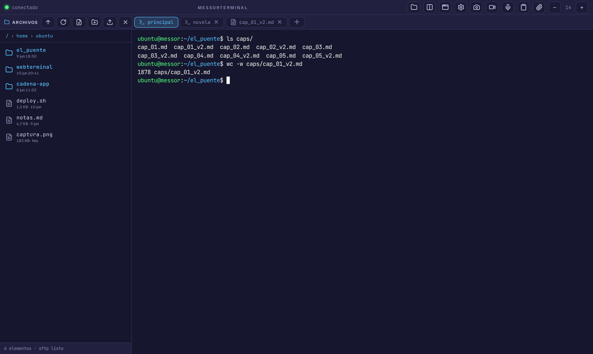

# >_ WebTerminal

**[ES]** Terminal SSH en el navegador, pensada para trabajar (también desde el móvil) con sesiones que no se mueren: tmux persistente, explorador y editor de archivos, subida por arrastre, dictado por voz y atajos táctiles. **[EN]** A self-hosted web SSH terminal built for real work — including from your phone — with persistent tmux sessions, a file explorer/editor, drag-and-drop uploads, voice dictation and touch-friendly controls.



## Características / Features

- **Sesiones persistentes (tmux)** — la sesión sobrevive a cortes de red y al cierre del navegador; reconectas y sigues donde estabas. Varias sesiones con pestañas, y vista dividida con dos terminales.
- **Terminal potente**: renderer WebGL (con fallback automático a DOM), búsqueda en el terminal (`Ctrl+Mayús+F`) con resaltado y contador, y **comandos favoritos** editables que aparecen como botones para lanzar con un clic.
- **Explorador de archivos (SFTP)** sobre tu propia sesión SSH: navegar, subir/descargar, crear, renombrar, borrar, y un **editor con resaltado de sintaxis**, borradores automáticos y detección de conflictos.
- **Móvil de verdad** (`/m`): PWA instalable, barra de teclas especiales (Esc, Ctrl, flechas…), dictado por voz, scroll táctil del histórico incluso dentro de tmux/Claude Code.
- **Pensada para IA**: sube una captura y la ruta se inyecta en la terminal (para Claude Code), proxy opcional a modelos por API (DeepSeek/Kimi) para editar archivos, y preview de webapps locales en una pestaña.
- **Seguridad en capas**: login web (bcrypt + JWT) separado de la identidad SSH, anti fuerza bruta con bloqueo temporal, CSP estricta, y el backend solo escucha en localhost (el TLS lo pone Caddy o Cloudflare por delante).

## Instalación / Install

En un servidor Debian/Ubuntu con `sshd` funcionando:

```bash
git clone https://github.com/igutiez/webterminal.git
cd webterminal
sudo ./install.sh
```

El instalador es un asistente paso a paso que pregunta lo imprescindible y configura el resto:

1. **Cómo se expone la app** (elige una):
   - **Caddy + Let's Encrypt** — tienes un dominio apuntando al servidor; TLS automático. *Recomendado.*
   - **Cloudflare Tunnel** — sin abrir puertos 80/443; requiere cuenta de Cloudflare.
   - **Solo local / Tailscale** — sin TLS público, para acceso por VPN o LAN de confianza.
2. **Dominio** (o IP de escucha en modo local) y puertos (detecta el de tu `sshd`).
3. **Primer usuario web** (email + contraseña).

Y deja: la app en `/opt/webterminal`, configuración en `/opt/webterminal/.env`, servicio systemd `webterminal` arrancado, y la URL lista para entrar. Re-ejecutarlo es seguro (es idempotente). Para modo desatendido: `./install.sh --help`.

**Actualizar:** `git pull && sudo ./deploy.sh`
**Más usuarios web:** `sudo /opt/webterminal/venv/bin/python /opt/webterminal/backend/manage.py create-user otro@email.com` (con `WEBTERMINAL_DB=/opt/webterminal/webterminal.db`).

## Cómo funciona / How it works

```
navegador ──HTTPS/WSS──▶ Caddy / Cloudflare Tunnel ──▶ FastAPI (127.0.0.1:8765)
                                                          │  login web (JWT)
                                                          ▼
                                                  paramiko ──▶ sshd local
                                                          │
                                                          ▼
                                              tmux new-session -A  (persistencia)
```

La identidad SSH **no se almacena**: cada usuario abre la terminal con su usuario y contraseña del sistema. El login web es solo la puerta de la aplicación. Toda la configuración vive en `/opt/webterminal/.env` (ver [`.env.example`](.env.example)).

## Requisitos / Requirements

- Debian/Ubuntu con systemd, Python 3.11+ y `sshd` con autenticación por contraseña para los usuarios que vayan a entrar.
- `tmux` para la persistencia de sesiones (lo instala el wizard; sin él, cae a un shell normal).
- Un dominio (modos Caddy/Cloudflare) o una VPN tipo Tailscale (modo local).

## Desarrollo / Development

- Frontend estático sin build: `frontend/` (escritorio) y `frontend/m/` (móvil). Sistema de diseño tokenizado en `:root` de cada `style.css`.
- Backend FastAPI en `backend/` (`main.py` rutas, `terminal.py` SSH/tmux, `db.py` usuarios, `manage.py` CLI).
- Capturas de verificación visual sin login: `python3 docs/visual_check.py` (Playwright).
- La instalación sirve `/opt/webterminal/frontend`: tras editar el repo, `sudo ./deploy.sh`.

## Licencia / License

[MIT](LICENSE)
